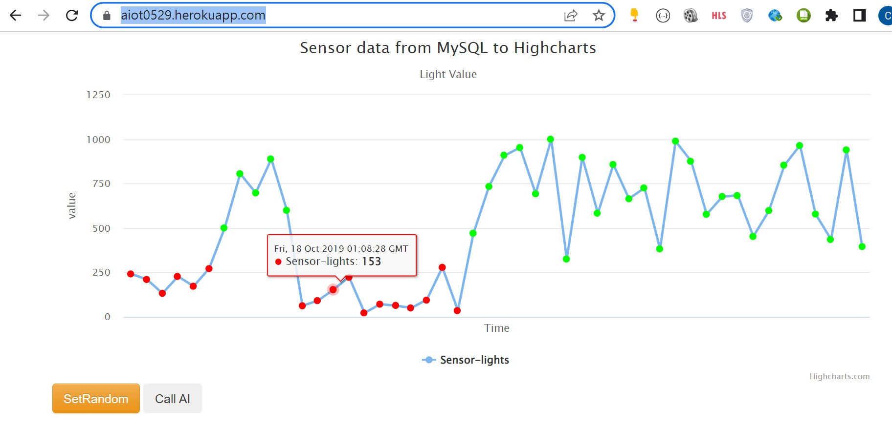

# AIoT Github

## Lecture 16: IoT Flask Web (deploy to heroku)
#### Author: Huan Chen 

### step 0:
    * 註冊 Heroku, github 請下載 HeidiSQL, VS code

### step 1 : Clone this github
* 將老師github上的資訊複製到我自己的github
* 建立新的repository叫做aiot_hw05
* github連結https://github.com/jhaorong/aiot_hw05
* 

### step 2 : install some package

* 使用python的指令下載flask,Jinja2,psycopg2,sklearn,pandas,numpy等package
* python指令如下
```python
pip install gunicorn  Flask==2.0.1 Jinja2==3.0.1 psycopg2 sklearn pandas numpy
```

### step 3: add an heroku postgredb

* 註冊heroku帳號
* 點擊dashboard並建立app

* 到resource頁面並將老師給的postgredb放入heroku

### step 4: login to heroku pstgredb using HeidiSQL
* 先點擊Resource並在右下角找到find more add-ons

* 搜尋Heroku postgres

* 點擊新增好的資料庫，並點擊setting，可以看到view credentials，找出HOST,DATABASE,USER,PASSWORD

* 開啟HeidiSQL與剛才建立的資料庫進行連線


```sql
myserver ="ec2-34-230-153-41.compute-1.amazonaws.com"
myuser="ncftmbglktshcr"
mypassword="f28f7ce14e09cb7761e96b6c1bcc6e57270f86e6c36d05ee99795fc73b46adee"
mydb="d8tqoiq8882cpn"

```
### step 5: import postgredb (in db/postgre.db)
* 在HeidiSQL中點選檔案並載入SQL檔案，將資料庫放入


### step 6: setting db in app.py
* 到app.py中設定HOST,DATABASE,USER,PASSWORD


```sql
myserver ="ec2-34-230-153-41.compute-1.amazonaws.com"
myuser="ncftmbglktshcr"
mypassword="f28f7ce14e09cb7761e96b6c1bcc6e57270f86e6c36d05ee99795fc73b46adee"
mydb="d8tqoiq8882cpn"

```
### step 7: testing locally by running python app.py
* 打開terminal輸入下面指令執行app.py
```python
python app.py
```
* 點擊http://127.0.0.1:5000/網址點開local的網頁
    * Random
        
    
### step 8: deploy to github (new public github repositoy 不然看不到)

delete .git and git remote add origin master github.com/xxxxx


### step 9: Heroku deploy from github

### step 10: Complete

Sample link 1:
https://awinlab-aiot.herokuapp.com/

Sample link 2: 
https://aiot0529.herokuapp.com/





